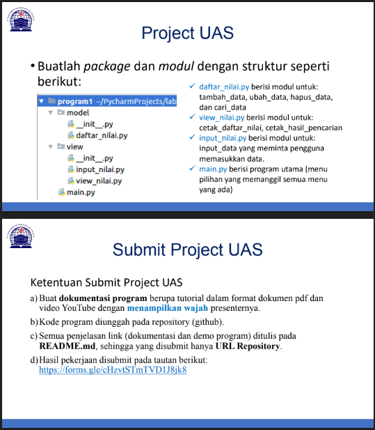
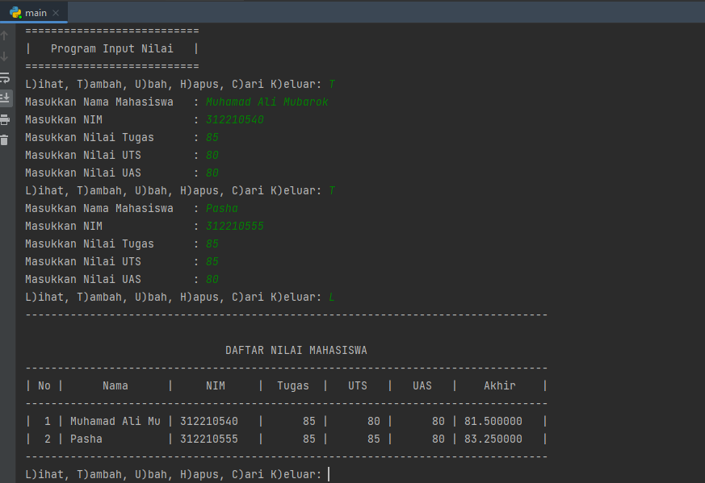
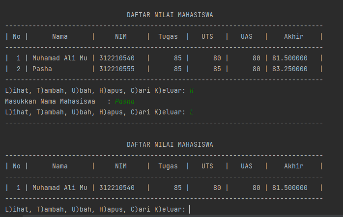
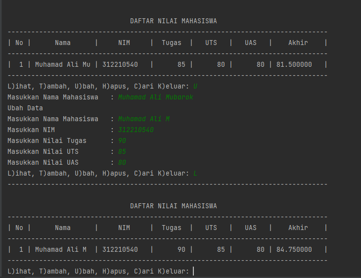
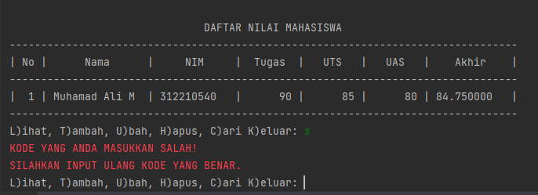

# Project UAS Bahasa Pemprograman

__Nama  : Muhamad Ali Mubarok__

__Nim   : 312210540__

__Kelas : T1.22.B2__


# Buatlah package dan modul dengan struktur seperti berikut:

1. daftar_nilai.py berisi modul untuk:

tambah_data, ubah_data, hapus_data,dan cari_data

2. view_nilai.py berisi modul untuk:

cetak_daftar_nilai, cetak_hasil_pencarian

3. input_nilai.py berisi modul untuk:

input_data yang meminta pengguna memasukkan data.

4. main.py berisi program utama (menu pilihan yang memanggil semua menu yang ada)

# Lembar soal UAS



## Berikut adalah program-programnya

- dibawah ini adalah script untuk daftar_nilai.py

```py
x = {}
def tambah(nama, nim, tugas, uts, uas):
    akhir = tugas * 30 / 100 + uts * 35 / 100 + uas * 35 / 100
    x[nama] = nim, tugas, uts, uas, akhir
def hapus(nama):
    if nama in x.keys():
        del x[nama]
        return True
    else:
        print("Nama {0} Tidak Ditemukan".format(nama))
        return False
def ubah(nama):
    if nama in x.keys():
        del x[nama]
        print("Ubah Data")
        from view.input_nilai import input_data
        input_data()
    else:
        print("Nama{0} Tidak Ditemukan".format(nama))
def cari(nama):
    if nama in x.keys():
        print("---------------------------------------------------------------------------------")
        print("\n                               DAFTAR NILAI MAHASISWA                    ")
        print("---------------------------------------------------------------------------------")
        print("|      Nama      |     NIM     |  Tugas  |   UTS   |   UAS   |    Akhir    |")
        print("---------------------------------------------------------------------------------")
        print("| {0:14s} | {1:11s} | {2:7d} | {3:7d} | {4:7d} | {5:7f}   |"
              .format(nama, x[nama][1], x[nama][2], x[nama][3], x[nama][4], x[nama][5]))
        print("---------------------------------------------------------------------------------")
    else:
        print("Nama {0} Tidak Ditemukan".format(nama))
```
- dibawah ini adalah script untuk view_nilai.py

```py
from model.daftar_nilai import x
def header():
    print("===========================")
    print("|   Program Input Nilai   |")
    print("===========================")
def kode_salah():
    CRED = '\033[91m'
    CEND = '\033[0m'
    print(CRED + "KODE YANG ANDA MASUKKAN SALAH!\nSILAHKAN INPUT ULANG KODE YANG BENAR." + CEND)
def tampilkan():
    if x.items():
        print("---------------------------------------------------------------------------------")
        print("\n                               DAFTAR NILAI MAHASISWA                    ")
        print("---------------------------------------------------------------------------------")
        print("| No |      Nama      |     NIM     |  Tugas  |   UTS   |   UAS   |    Akhir    |")
        print("---------------------------------------------------------------------------------")
        i = 0
        for b in x.items():
            i += 1
            print("| {no:2d} | {0:14s} | {1:11s} | {2:7d} | {3:7d} | {4:7d} | {5:7f}   |"
                  .format(b[0][: 14], b[1][0], b[1][1], b[1][2], b[1][3], b[1][4], no=i))
        print("---------------------------------------------------------------------------------")
    else:
        print("---------------------------------------------------------------------------------")
        print("\n                               DAFTAR NILAI MAHASISWA                    ")
        print("---------------------------------------------------------------------------------")
        print("| No |      Nama      |     NIM     |  Tugas  |   UTS   |   UAS   |    Akhir    |")
        print("---------------------------------------------------------------------------------")
        print("|                                TIDAK ADA DATA                                 |")
        print("---------------------------------------------------------------------------------")
def cari():
    from view.input_nilai import cari
    cari()
```
- dibawah ini adalah script untuk input_nilai.py

```py
def input_data():
    from model.daftar_nilai import tambah
    nama = input("Masukkan Nama Mahasiswa   : ")
    nim = input("Masukkan NIM              : ")
    tugas = int(input("Masukkan Nilai Tugas      : "))
    uts = int(input("Masukkan Nilai UTS        : "))
    uas = int(input("Masukkan Nilai UAS        : "))
    tambah(nama, nim, tugas, uts, uas)
def ubah_data():
    from model.daftar_nilai import ubah
    ubah(nama=input("Masukkan Nama Mahasiswa   : "))
def hapus_data():
    from model.daftar_nilai import hapus
    hapus(nama=input("Masukkan Nama Mahasiswa   : "))
def cari():
    from model.daftar_nilai import cari
    cari(nama=input("Masukkan Nama Mahasiswa   : "))
```
- dibawah ini adalah script untuk main.py

```py
from view.view_nilai import cari, tampilkan, header, kode_salah
from view.input_nilai import input_data, ubah_data, hapus_data
header()
while True:
    c = input("L)ihat, T)ambah, U)bah, H)apus, C)ari K)eluar: ")
    if c.lower() == "l":
        tampilkan()
    elif c.lower() == "t":
        input_data()
    elif c.lower() == "c":
        cari()
    elif c.lower() == "u":
        ubah_data()
    elif c.lower() == "h":
        hapus_data()
    elif c.lower() == "k":
        print()
        print("---------------------------------------------------------------------------------")
        print("                                 PROGRAM TELAH SELESAI                    ")
        print("---------------------------------------------------------------------------------")
        break
    else:
        kode_salah()
```

## Berikut adalah hasil output programnya

- dibawah ini adalah hasil program ketika  input data dan menambahkan data



- dibawah ini adalah hasil program ketika menghapus data



- dibawah ini adalah hasil program ketika mengubah data



-  dibawah ini adalah contoh ketika salah memasukan kode




# Link Youtube


jangan lupa like & Subcribe ya :D 

# SELESAI
